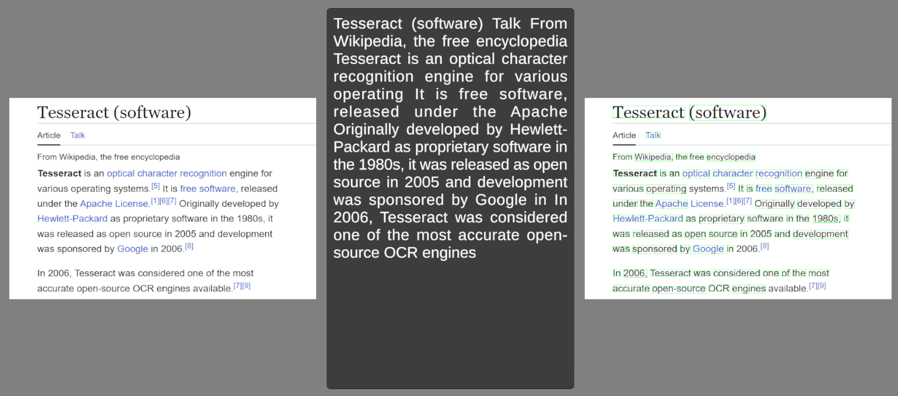

# OCR for Unity via Tesseract
A simple library that allow you to run [Tesseract](https://github.com/tesseract-ocr/tesseract) **O**ptical **C**haracter **R**ecognition in Unity applications on **Windows**

> [!Tip]
> For other platforms, check out the original repo instead

## Prerequisite
1. Obtain the Tesseract library and model:

    

    
<b>Recommended</b> Way

    1. Go to [Tesseract Installers for Windows](https://digi.bib.uni-mannheim.de/tesseract/)
    2. Download the setup `.exe`
        - This repo was built on `tesseract-ocr-w64-setup-v4.1.0.20190314.exe`
        - `v5.x` is incompatible
    3. Select the language(s) of choice and install
    4. Navigate to the installation folder
        - **Default:** `C:\Users\<user name>\AppData\Local\Tesseract-OCR`
    5. Copy all the `.dll` to the `Plugins` folder in Unity
    6. Copy the `tessdata` folder to the `StreamingAssets` folder in Unity

    

    

    
<b>Lazy</b> Way

    1. Download `Plugins.zip` from [Releases](https://github.com/Haoming02/tesseract-ocr-unity/releases) and extract into Unity
    2. Download `tessdata.zip` from [Releases](https://github.com/Haoming02/tesseract-ocr-unity/releases) and extract into the `StreamingAssets` folder in Unity

    

2. Download and install the `.unitypackage` from [Releases](https://github.com/Haoming02/tesseract-ocr-unity/releases)

## How to Use

1. Call the `Init` function under `Tesseract` static class
    - **lang:** The language to detect
        - Refer to the official [LangCode](https://tesseract-ocr.github.io/tessdoc/Data-Files-in-different-versions.html)
    - **minimumConfidence:** The minimum score a word needs in order to be considered correct
    - **createHighlight:** Whether to create green highlight boxes on the image
    - **onSetupComplete:** The callback that gets triggered when the model is loaded successfully

> [!Important]
> Due to how non-Latin characters *(**eg.** Japanese, Chinese)* works, the original implementation of separating "words" using spaces does not work. The current workaround is to set the `confidence` to **negative**, telling the function to simply return the entire detected text.

2. Call the `Recognize` function under `Tesseract`
3. (Optional) Call the `GetHighlight` function under `Tesseract` if enabled

 

## Demo

> [!Tip]
> Or, just use a modern vision model *(**eg.** `gemma3:4b`)* instead
