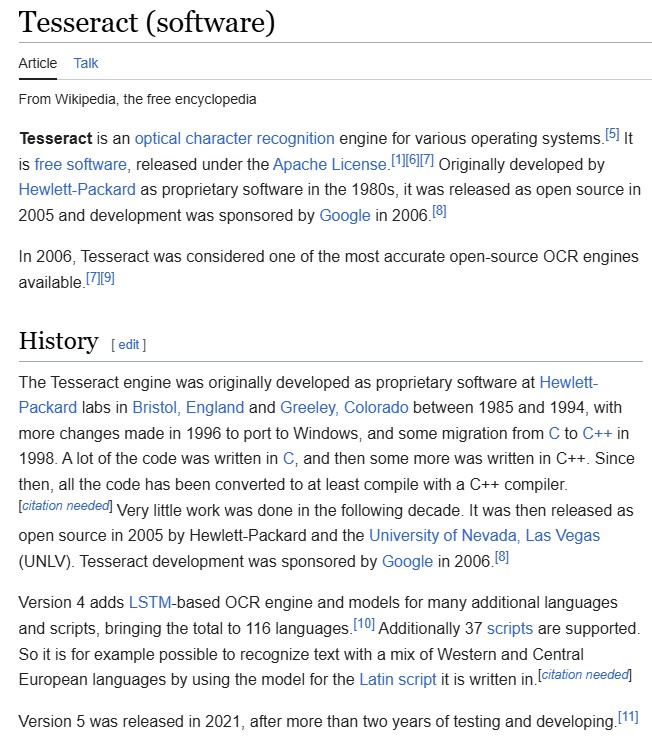
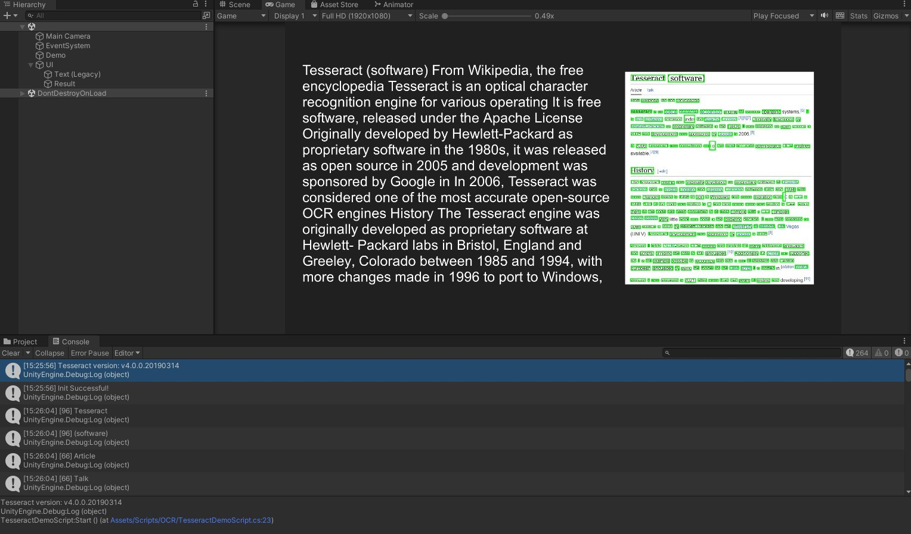

# OCR for Unity via Tesseract
The repo provides C# scripts that allow you to run [Tesseract](https://github.com/tesseract-ocr/tesseract) **O**ptical **C**haracter **R**ecognition inside UnityEngine on **Windows**

> For other platforms, please check out the original repo instead

## Prerequisite
- Unity Editor
- Clone the `.cs` scripts
- Obtain the Tesseract library and model:

    #### Recommended Way
    1. Go to [Tesseract Installers for Windows](https://digi.bib.uni-mannheim.de/tesseract/)
    2. Download the setup `.exe`
        > - This repo was built on `tesseract-ocr-w64-setup-v4.1.0.20190314.exe`
        > - `v5.x` may cause incompatible API
    3. Select the language(s) of choice and install
    4. Navigate to the installation folder
        > **Default:** `C:\Users\<user name>\AppData\Local\Tesseract-OCR`
    5. Copy all the `.dll` to the `Plugins` folder in Unity
    6. Copy the `tessdata` folder to the `StreamingAssets` folder in Unity

    #### Lazy Way
    1. Download `Plugins` from [Releases](https://github.com/Haoming02/tesseract-ocr-unity/releases)
    2. Download `tessdata` from [Releases](https://github.com/Haoming02/tesseract-ocr-unity/releases)

## How to Use
> An example `TesseractDemoScript.cs` is included

1. Call the `Init` function under `Tesseract.Driver`
    #### Parameters
    - **lang:** The language to detect. Refer to the [LangCode](https://tesseract-ocr.github.io/tessdoc/Data-Files-in-different-versions.html).
    - **confidence:** The minimum score a word needs in order to be considered correct
        - **Important:** Due to how non-Latin characters *(**eg.** Chinese, Japanese)* works, the original implementation of separating "words" using spaces does not work. The current workaround is to set the `confidence` to **negative**, telling the function to simply return the entire detected text.
    - **highlight:** Wether to produce the green highlight boxes on the image as shown below.
        - If you only need the text outputs, disabling this can speed up the process.
    - **onSetupComplete:** The callback that gets triggered when the model finishes loading successfully

2. Call the `Recognize` function under `Tesseract.Driver`
    - The parameter is the `Texture2D` to perform OCR on

## Example

 
<code>Input</code>
|
<code>Result</code>

## Changes
- Made the Driver `static`
- Made some codes `async`
- *Support non-Latin characters

## License
[Apache-2.0 License](LICENSE)

- [How it Works](https://medium.com/xrpractices/offline-ocr-using-tesseract-in-unity-part-1-b9a717ac7bcb)
